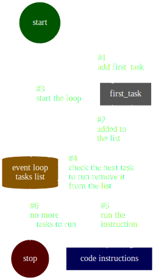
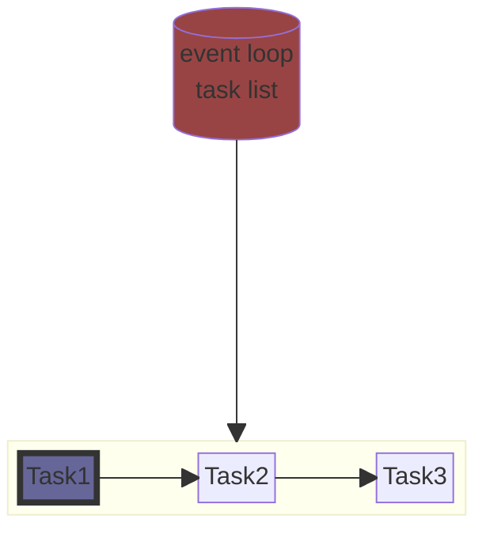
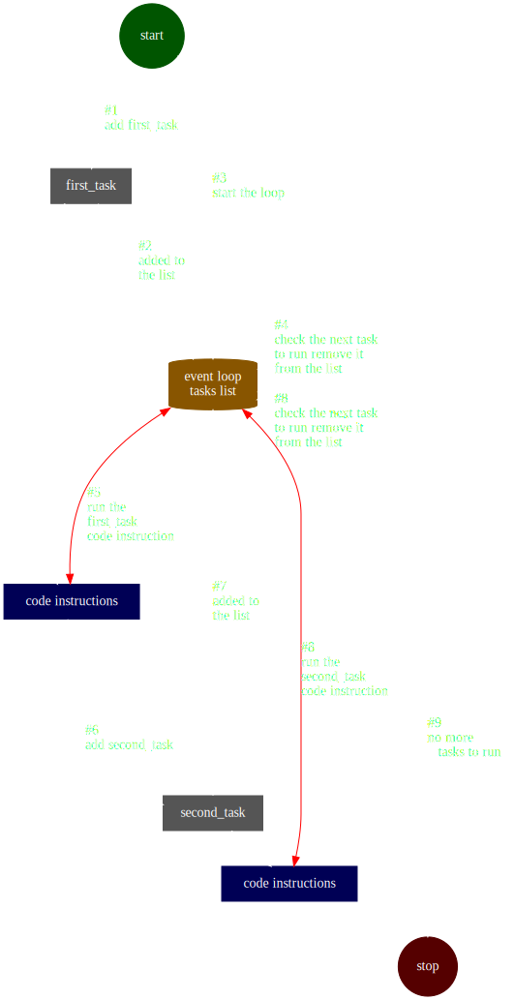

# Differences with Python


## sequence of instructions

Python run instruction by instruction

```python
# python

print("A") # <- instruction 1
print("B") # <- instruction 2 (next)
print("C") # <- instruction 3 (next next)
```

Javascript also run instruction by instruction

JS:
```js
// javascript

console.log("A") // <- instruction 1
console.log("B") // <- instruction 2 (next)
console.log("C") // <- instruction 3 (next next)
```

## sequence of when calling a function

Python can use function as well
* instruction 1 define the function
* instruction 2 will call the function's internal instructions
* instruction 3 will call the function's internal instructions

```python
# python

def my_function(): # <- instruction 1: create the function
  print("A") # <- instruction 2.1 (but also 3.1)
  print("B") # <- instruction 2.2 (but also 3.2)
  print("C") # <- instruction 2.3 (but also 3.3)

my_function() # <- instruction 2
my_function() # <- instruction 3

print("done") # <- instruction 4
```

Javascript can do the same

```js
// javascript

const my_function = () => { // <- instruction 1: create the function
  console.log("A"); // <- instruction 2.1 (but also 3.1)
  console.log("B"); // <- instruction 2.2 (but also 3.2)
  console.log("C"); // <- instruction 2.3 (but also 3.3)
}

my_function(); // <- instruction 2
my_function(); // <- instruction 3

console.log("done"); // <- instruction 4
```

## what JavaScript does differently

```js
// javascript

const my_callback = () => { // instruction 1: create the function
  console.log("A2"); // <- instruction 6
  console.log("B2"); // <- instruction 7
  console.log("C2"); // <- instruction 8
}

setTimeout(my_callback, 500) // instruction 2: setup a timeout callback

console.log("A1"); // instruction 3
console.log("A2"); // instruction 4
console.log("A3"); // instruction 5

```

How does this work?



### event loop task list example




### a task can push more tasks to the event loop





### Example

```js
// javascript

// first task start

const my_callback = () => { // first_task-instruction 1: create the function

  // second task start
  console.log("A2"); // <- second_task-instruction 1
  console.log("B2"); // <- second_task-instruction 2
  console.log("C2"); // <- second_task-instruction 3
}

setTimeout(my_callback, 500) // first_task-instruction 2: setup a timeout callback

console.log("A1"); // first_task-instruction 3
console.log("A2"); // first_task-instruction 4
console.log("A3"); // first_task-instruction 5

```

## JavaScript was made to react to things happening

Javascript will do nothing by default, and only react to things

### browser app

```js

// here we react to a button being pressed

// subscribe to something
myButton.addEventListener('click', () => {
  // do something only when the button is clicked
});
```

### server app

```js

// here we react to a user request being received

const http = require('http');

// subscribe to something (new user request)
const server = http.createServer((request, response) => {
  // do something only where the a user request is received

  // reply to the user request
  response.write("hello world");
  response.end();
});
server.listen(8000);
```


