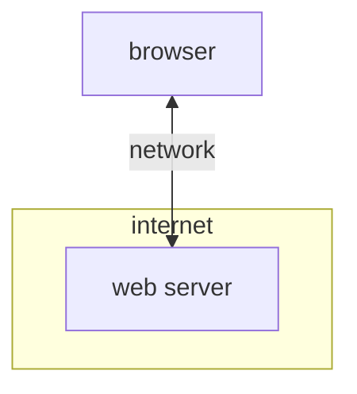
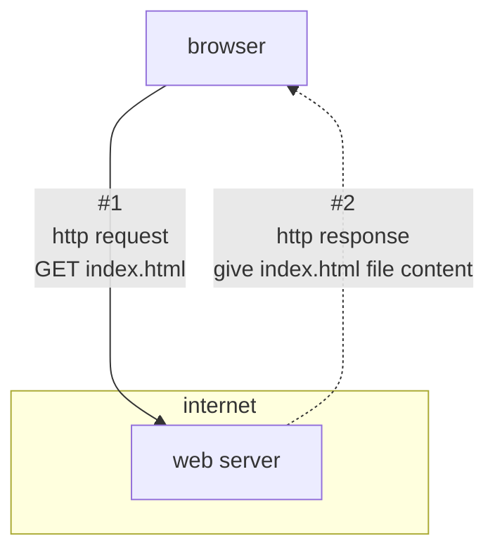
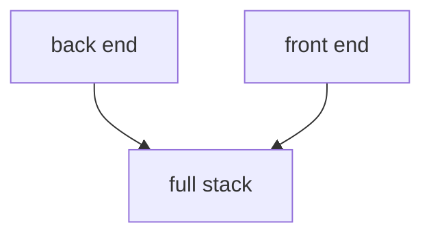
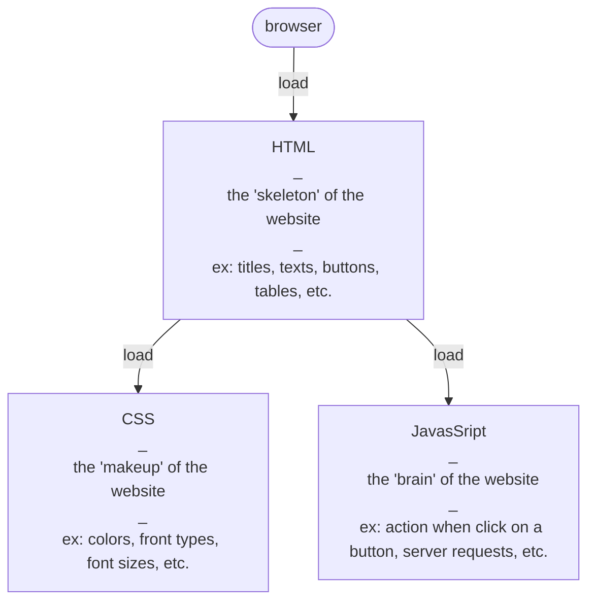
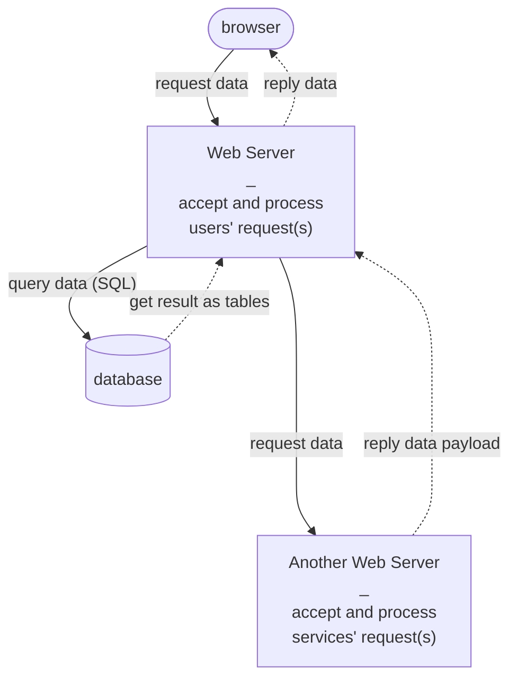
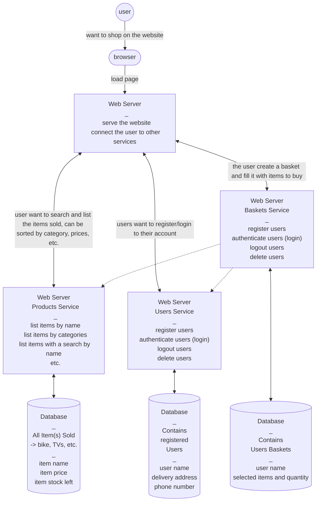

# How does "the web" work

## Part 1
### How does the internet works

## Part 2:
### Get an html file to render in the browser

# job types: overview

# Focus on frontend

# Focus on backend

# Deeper Focus on backend

