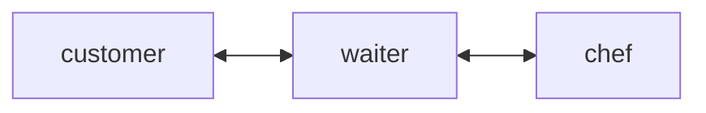
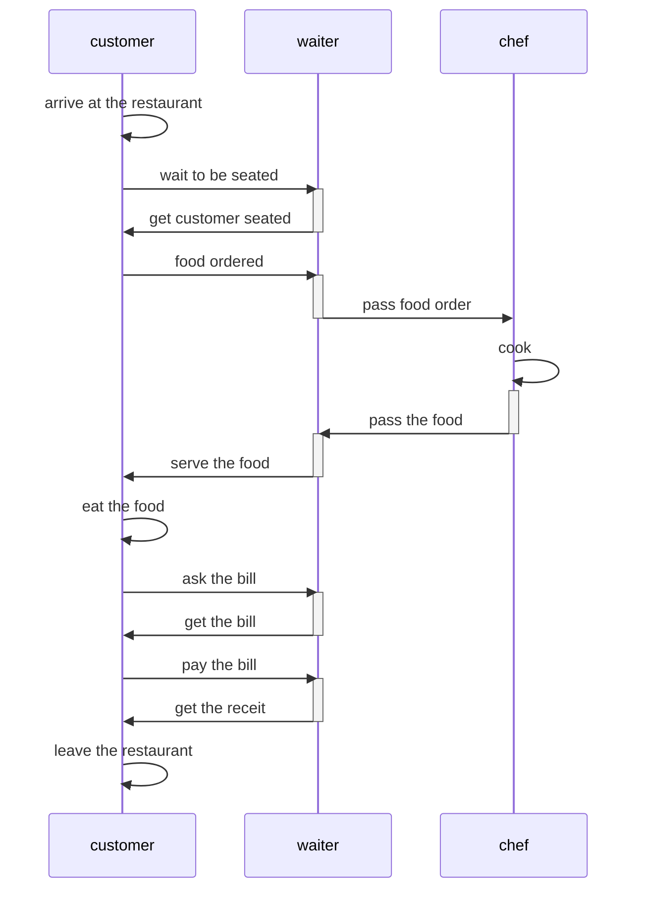
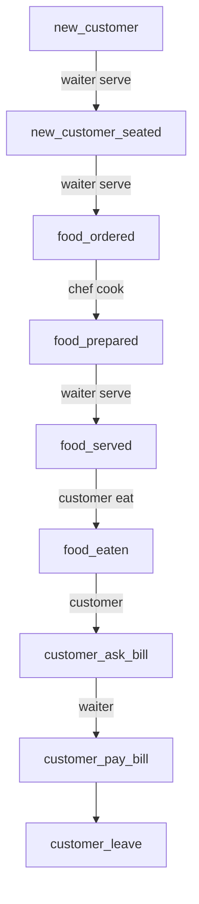
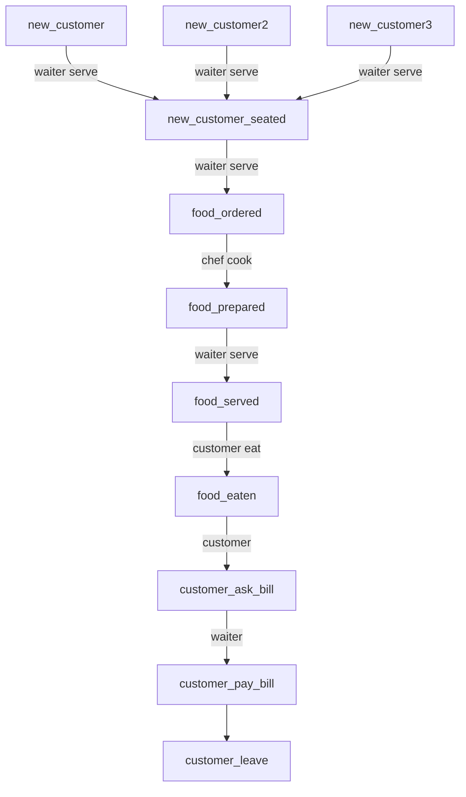

# Why nodejs?

## Restaurant crew

```mermaid
flowchart LR
  customer <--> waiter <--> chef
```

## Sequential

---

```mermaid
sequenceDiagram
  participant customer
  participant waiter
  participant chef

  customer ->> customer: arrive at the restaurant
  customer ->> waiter: wait to be seated
  activate waiter
  waiter ->> customer: get customer seated
  deactivate waiter

  customer ->> waiter: food ordered
  activate waiter
  waiter ->> chef: pass food order
  deactivate waiter
  chef ->> chef: cook
  activate chef
  chef ->> waiter: pass the food
  deactivate chef
  activate waiter
  waiter ->> customer: serve the food
  deactivate waiter
  customer ->> customer: eat the food
  customer ->> waiter: ask the bill
  activate waiter
  waiter ->> customer: get the bill
  deactivate waiter
  customer ->> waiter: pay the bill
  activate waiter
  waiter ->> customer: get the receit
  deactivate waiter

  customer ->> customer: leave the restaurant

```

---

```mermaid
flowchart
  new_customer -- waiter serve--> new_customer_seated
  new_customer_seated --waiter serve--> food_ordered
  food_ordered --chef cook--> food_prepared
  food_prepared --waiter serve--> food_served
  food_served --customer eat--> food_eaten
  food_eaten --customer--> customer_ask_bill
  customer_ask_bill --waiter--> customer_pay_bill
  customer_pay_bill --> customer_leave
```

## Concurrent

---

```mermaid
sequenceDiagram
  participant customer
  participant waiter
  participant chef

  customer ->> customer: arrive at the restaurant
  customer ->> waiter: wait to be seated
  activate waiter
  waiter ->> customer: get customer seated
  deactivate waiter

  customer ->> waiter: food ordered
  activate waiter
  waiter ->> chef: pass food order
  deactivate waiter
  chef ->> chef: cook
  activate chef
  chef ->> waiter: pass the food
  deactivate chef
  activate waiter
  waiter ->> customer: serve the food
  deactivate waiter
  customer ->> customer: eat the food
  customer ->> waiter: ask the bill
  activate waiter
  waiter ->> customer: get the bill
  deactivate waiter
  customer ->> waiter: pay the bill
  activate waiter
  waiter ->> customer: get the receit
  deactivate waiter

  customer ->> customer: leave the restaurant

```

```mermaid
flowchart
  new_customer -- waiter serve--> new_customer_seated
  new_customer2 -- waiter serve--> new_customer_seated
  new_customer3 -- waiter serve--> new_customer_seated
  new_customer_seated --waiter serve--> food_ordered
  food_ordered --chef cook--> food_prepared
  food_prepared --waiter serve--> food_served
  food_served --customer eat--> food_eaten
  food_eaten --customer--> customer_ask_bill
  customer_ask_bill --waiter--> customer_pay_bill
  customer_pay_bill --> customer_leave
```
