# TypeScript without "compilation"

## Install with npm

```bash
# this is how a the "package.json" file
# is created in the current folder
# => the "-y" is to force it to say "yes to all prompt"
npm init -y

# install the package "typescript" in the "node_module" folder
# => this will update the the "package.json" file
npm install --save-dev typescript tsx
```

## run with node

```bash
# this will create the "tsconfig.json" file
npx tsc --init

# this will run the "index.ts" file directly
npx tsx index.ts
```

## Graph

---
### Graph step 0: starting point

```mermaid
flowchart LR

  classDef executable fill:#632
  classDef command fill:#400
  classDef file fill:#326

  subgraph nodejs
    node:::executable
    npm:::executable
    npx:::executable
  end

  subgraph folder
    index.ts["index.ts
    (file)"]:::file
  end

```



```bash
.
└── index.ts
```

---

### Graph step 1: setup the package.json

```mermaid
flowchart LR

  classDef executable fill:#632
  classDef command fill:#400
  classDef file fill:#326

  subgraph nodejs
    node:::executable
    npm:::executable
    npx:::executable
  end

  npm_init["npm --init -y"]:::command

  subgraph folder
    index.ts["index.ts
    (file)"]:::file
    package.json["package.json
    (file)"]:::file
  end

  npm --> npm_init -. "this create
  the package.json" .-> package.json

```



```bash
.
├── index.ts
└── package.json <-- NEW
```

---
### Graph step 2: install packages

```mermaid
flowchart

  classDef executable fill:#632
  classDef command fill:#400
  classDef file fill:#326
  classDef folder fill:#440

  subgraph nodejs
    node:::executable
    npm:::executable
    npx:::executable
  end

  npm_install["npm install --save typescript tsx"]:::command

  npm --> npm_install

  npm_install -- "this installed
  the 'tsc' and 'tsx' packages" --> node_modules

  npm_install -. "the package.json file
  list the newly
  installed packages" .-> package.json

  subgraph folder
    index.ts["index.ts
    (file)"]:::file
    package.json["package.json
    (file)"]:::file
    node_modules["node_modules/
    (folder)"]:::folder
    node_modules --> tsc:::file
    node_modules --> tsx:::file
  end

```



```bash
.
├── index.ts
├── package.json
└── node_modules    <-- NEW
    ├── typescript  <-- NEW
    └── tsx         <-- NEW
```

---

### Graph step 3: setup the typescript config

```mermaid
flowchart

  classDef executable fill:#632
  classDef command fill:#400
  classDef file fill:#326
  classDef folder fill:#440

  subgraph nodejs
    node:::executable
    npm:::executable
    npx:::executable
  end

  npx_tsc["npx tsc --init"]:::command

  npx --> npx_tsc

  npx_tsc -- "this setup the
  tsconfig.json file" ---> tsconfig.json

  subgraph folder
    index.ts["index.ts
    (file)"]:::file
    package.json["package.json
    (file)"]:::file
    tsconfig.json["tsconfig.json
    (file)"]:::file
    node_modules["node_modules/
    (folder)"]:::folder
    node_modules --> tsc:::file
    node_modules --> tsx:::file
  end

```



```bash
.
├── index.ts
├── package.json
├── node_modules
│   ├── typescript
│   └── tsx
└── tsconfig.json   <-- NEW
```


---

### Graph step 4: compile the typescript program

```mermaid
flowchart

  classDef executable fill:#632
  classDef command fill:#400
  classDef file fill:#326
  classDef folder fill:#440

  subgraph nodejs
    node:::executable
    npm:::executable
    npx:::executable
  end

  npx_tsc["npx tsc"]:::command

  npx --> npx_tsc

  npx_tsc -- "this compile the
  typescript file into
  a JavaScript file" ---> index.ts

  index.ts == "create" ==> index.js

  subgraph folder
    index.ts["index.ts
    (file)"]:::file
    index.js["index.js
    (file)"]:::file
    package.json["package.json
    (file)"]:::file
    tsconfig.json["tsconfig.json
    (file)"]:::file
    node_modules["node_modules/
    (folder)"]:::folder
    node_modules --> tsc:::file
    node_modules --> tsx:::file
  end

```



```bash
.
├── index.ts
├── index.js       <-- NEW
├── package.json
├── node_modules
│   ├── typescript
│   └── tsx
└── tsconfig.json
```


---

### Graph step 5: run the javascript program

```mermaid
flowchart

  classDef executable fill:#632
  classDef command fill:#400
  classDef file fill:#326
  classDef folder fill:#440

  subgraph nodejs
    node:::executable
    npm:::executable
    npx:::executable
  end

  node_command["node index.js"]:::command

  node --> node_command

  node_command -- "this run the
  JavaScript file" ---> index.js

  subgraph folder
    index.ts["index.ts
    (file)"]:::file
    index.js["index.js
    (file)"]:::file
    package.json["package.json
    (file)"]:::file
    tsconfig.json["tsconfig.json
    (file)"]:::file
    node_modules["node_modules/
    (folder)"]:::folder
    node_modules --> tsc:::file
    node_modules --> tsx:::file
  end

```



```bash
UNCHANGED
.
├── index.ts
├── index.js
├── package.json
├── node_modules
│   ├── typescript
│   └── tsx
└── tsconfig.json
```


